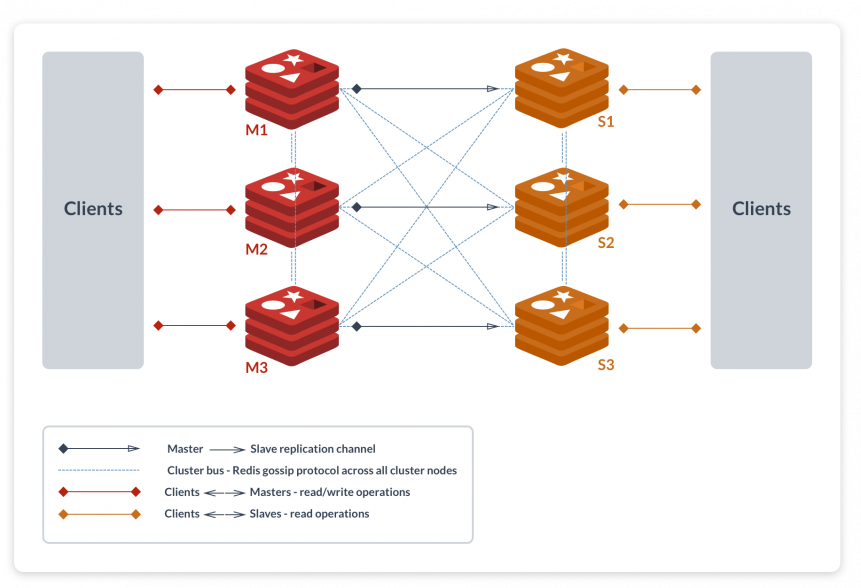

# Redis

- [Download &amp; Install](#download--install)
- [Data Types](#data-types)
- [Configuration](#configuration)
- [Persistence](#persistence)
- [Cluster](#cluster)
- [Sharding](#sharding)

## Download & Install

https://redis.io/download

## Data Types
- Strings
    - Binary Safe
    - Max length 512 Megabytes
    - all commands - https://redis.io/commands/#string
    - examples

        ```
        SET name john
        OK
        ```

        ```
        GET name
        "john"
        ```
- List
    - they're simply list of Strings
    - sorted by insertion order
    - it is possible to push elements to head or tail
    - it is possible to push elements at a particular index
    - max length of a list is 2<sup>32</sup> - 1 elements (4294967295, more than 4 billion of elements)
    - all commands - https://redis.io/commands#list
    - examples

        ```
        LPUSH numbers 1 2 3 4 5
        (integer) 5 // size of the list
        ```

        ```
        LRANGE numbers 0 -1
        1) "5"
        2) "4"
        3) "3"
        4) "2"
        5) "1"
        ```
- Sets
    - they're unordered collection of Strings
    - does not allow repeated elements
    - max number of members in a set is 2<sup>32</sup> - 1 elements (4294967295, more than 4 billion of elements)
    - all commands - https://redis.io/commands#set
    - examples

        ```
        SADD numbers 1 2 2 3
        (integer) 3 // size of the set
        ```

        ```
        SMEMBERS numbers
        1) "1"
        2) "2"
        3) "3"
        ```
- Sorted Sets
    - similar to sets with only difference that every element is associated with a score
    - all commands - https://redis.io/commands#sorted_set
    - examples
        ```
        ZADD numbers 1 two 2 one
        (integer) 0
        ```

        ```
        ZRANGE numbers 0 -1 WITHSCORES
        1) "two"
        2) "1"
        3) "one"
        4) "2"
        ```
- Hashes
    - they're maps between string fields and string values
    - they're perfect to represent objects
    - every hash can store upto 2<sup>32</sup> - 1 field-value pairs (more than 4 billion)
    - all commands - https://redis.io/commands#hash
    - examples
        
        ```
        HMSET user:1000 firstName john lastName doe address CA
        OK
        ```

        ```
        HGETALL user:1000
        1) "firstName"
        2) "john"
        3) "lastName"
        4) "doe"
        5) "address"
        6) "CA"
        ```

## Configuration
- by default redis picks up the configuration from `redis.conf` present in the redis installations root folder
- we can provide redis with a custom configuration path when starting it
    ```
    <path-to-redis-installation>/redis-server <pah-to-redis-configuration-file>
    ```
- List configurations
    - all configurations
        ```
        INFO
        # Server
        redis_version:5.0.7
        redis_git_sha1:00000000
        redis_git_dirty:0
        redis_build_id:bfa2ad76ea8e4f31
        redis_mode:standalone
        os:Linux 4.15.0-88-generic x86_64
        arch_bits:64
        multiplexing_api:epoll
        atomicvar_api:atomic-builtin
        gcc_version:7.4.0
        process_id:16270
        run_id:736afc29e4391fdde7dcb9c8fbff87c4128a951a
        tcp_port:6379
        uptime_in_seconds:2474
        uptime_in_days:0
        hz:10
        configured_hz:10
        lru_clock:6353914
        executable:/home/globallogic/redis/src/redis-server
        config_file:/home/globallogic/redis/redis.conf

        # Clients
        connected_clients:1
        client_recent_max_input_buffer:2
        client_recent_max_output_buffer:0
        blocked_clients:0
        ```
    - section wise configurations
        ```
        INFO server
        # Server
        redis_version:5.0.7
        redis_git_sha1:00000000
        redis_git_dirty:0
        redis_build_id:bfa2ad76ea8e4f31
        redis_mode:standalone
        os:Linux 4.15.0-88-generic x86_64
        arch_bits:64
        multiplexing_api:epoll
        atomicvar_api:atomic-builtin
        gcc_version:7.4.0
        process_id:16270
        run_id:736afc29e4391fdde7dcb9c8fbff87c4128a951a
        tcp_port:6379
        uptime_in_seconds:2513
        uptime_in_days:0
        hz:10
        configured_hz:10
        lru_clock:6353953
        executable:/home/globallogic/redis/src/redis-server
        config_file:/home/globallogic/redis/redis.conf
        ```

## Persistence
- RDB
    - point-in-time snapshots at specified intervals
    - compact single-file
    - default config
        ```
        save 900 1
        save 300 10
        save 60 10000
        ```
- AOF
    - more durable because of different fsync policies
    - append only file and can get very big in size
    - default config
        ```
        appendfsync everysec
        ```

Further references - https://redis.io/topics/persistence

## Cluster

- Redis consists of 0 - 16383 hash slots
- We can have 16384 nodes in a cluster. However, it is recommended to have ~1000 
- You should have minimum of 3 masters. During the failure detection, the majority of the master nodes are required to come to an agreement. If there are only 2 masters, say A and B and B failed, then the A master node cannot reach to a decision according to the protocol. The A node needs another third node, say C, to tell A that it also cannot reach B.

- Create a Redis cluster

    ```shell script
    <path-to-redis-installation>/utils/create-cluster/create-cluster start
  
    Starting 30001
    Starting 30002
    Starting 30003
    Starting 30004
    Starting 30005
    Starting 30006
    ```
  
    ```shell script
    <path-to-redis-installation>/utils/create-cluster/create-cluster create
    
    >>> Performing hash slots allocation on 6 nodes...
    Master[0] -> Slots 0 - 5460
    Master[1] -> Slots 5461 - 10922
    Master[2] -> Slots 10923 - 16383
    Adding replica 127.0.0.1:30005 to 127.0.0.1:30001
    Adding replica 127.0.0.1:30006 to 127.0.0.1:30002
    Adding replica 127.0.0.1:30004 to 127.0.0.1:30003
    >>> Trying to optimize slaves allocation for anti-affinity
    [WARNING] Some slaves are in the same host as their master
    M: a5d49d74ca31fed0970389612a2fbcf229eb5d0c 127.0.0.1:30001
       slots:[0-5460] (5461 slots) master
    M: 6bc2f9a8ce4c46370023b2c38084b770d4c7afde 127.0.0.1:30002
       slots:[5461-10922] (5462 slots) master
    M: 928e1e3c6095203ff9089686d121015bc8db5661 127.0.0.1:30003
       slots:[10923-16383] (5461 slots) master
    S: c92335a6cfbb416cf29047996554f8a091ed1612 127.0.0.1:30004
       replicates 6bc2f9a8ce4c46370023b2c38084b770d4c7afde
    S: 2a42b16aa2f922f8c40fc62e870ea39797ebe123 127.0.0.1:30005
       replicates 928e1e3c6095203ff9089686d121015bc8db5661
    S: 98accb1d54ed53087231ae92b3c9c063534f2e22 127.0.0.1:30006
       replicates a5d49d74ca31fed0970389612a2fbcf229eb5d0c
    Can I set the above configuration? (type 'yes' to accept): yes
    >>> Nodes configuration updated
    >>> Assign a different config epoch to each node
    >>> Sending CLUSTER MEET messages to join the cluster
    Waiting for the cluster to join
    .
    >>> Performing Cluster Check (using node 127.0.0.1:30001)
    M: a5d49d74ca31fed0970389612a2fbcf229eb5d0c 127.0.0.1:30001
       slots:[0-5460] (5461 slots) master
       1 additional replica(s)
    S: 98accb1d54ed53087231ae92b3c9c063534f2e22 127.0.0.1:30006
       slots: (0 slots) slave
       replicates a5d49d74ca31fed0970389612a2fbcf229eb5d0c
    S: 2a42b16aa2f922f8c40fc62e870ea39797ebe123 127.0.0.1:30005
       slots: (0 slots) slave
       replicates 928e1e3c6095203ff9089686d121015bc8db5661
    S: c92335a6cfbb416cf29047996554f8a091ed1612 127.0.0.1:30004
       slots: (0 slots) slave
       replicates 6bc2f9a8ce4c46370023b2c38084b770d4c7afde
    M: 6bc2f9a8ce4c46370023b2c38084b770d4c7afde 127.0.0.1:30002
       slots:[5461-10922] (5462 slots) master
       1 additional replica(s)
    M: 928e1e3c6095203ff9089686d121015bc8db5661 127.0.0.1:30003
       slots:[10923-16383] (5461 slots) master
       1 additional replica(s)
    [OK] All nodes agree about slots configuration.
    >>> Check for open slots...
    >>> Check slots coverage...
    [OK] All 16384 slots covered.
    ```    

    This gives us 3 masters 
    
    ```
    127.0.0.1:30001
    127.0.0.1:30002
    127.0.0.1:30003
    ```
    
    and, 3 slaves
    
    ```
    127.0.0.1:30005 to 127.0.0.1:30001
    127.0.0.1:30006 to 127.0.0.1:30002
    127.0.0.1:30004 to 127.0.0.1:30003
    ```

## Sharding
  
  - A redis cluster is a simple data sharding strategy.
  - It automatically partitions data across multiple Redis nodes.
  - Every key is mapped to a particular hash slot with the help of
  a distributed algorithm
  
    ```
    HASH_SLOT = CRC16(key) mod HASH_SLOTS_NUMBER
    ```   
    
    for eg:
    
    ```
    slot = CRC16(“name”) % 16384
    ```
    
    ```shell script
    127.0.0.1:30001> SET name "john"
    -> Redirected to slot [5798] located at 127.0.0.1:30002
    OK
    127.0.0.1:30002>
    ```